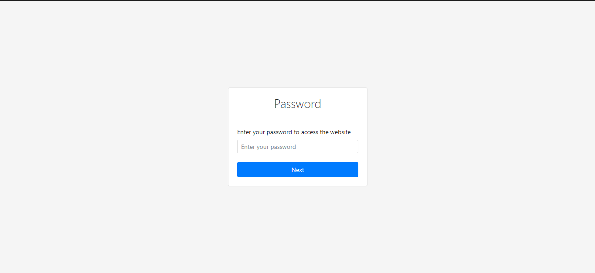
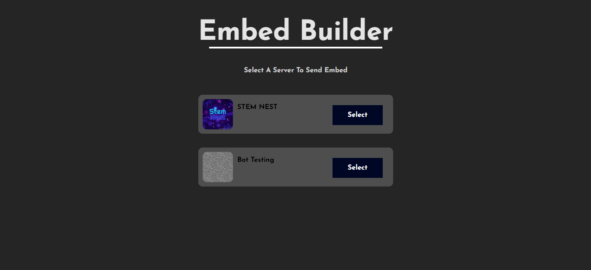
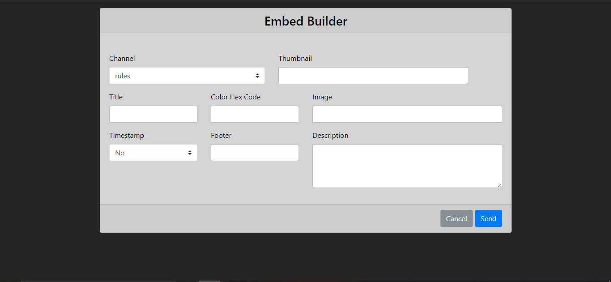
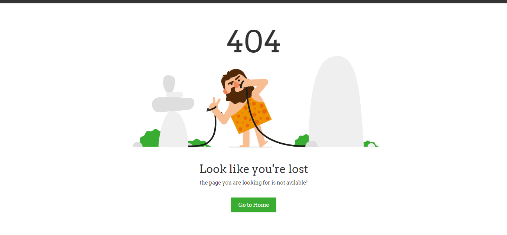

# Embed-Builder for Discord

One of the most powerful discord embed builder with a responsive panel.

## Features
- Password Protected 
- Server List 
- Full Embed Customization 

## Host it with heroku 

It is a simple one click hosting option with heroku button

[](https://heroku.com/deploy?template=https://github.com/Max2408/Embed-Builder)

## Host it manually 

For hosting it manually clone the repo and make a .env file in the project directory 

```env 
TOKEN=YOUR_BOT_TOKEN
PASSWORD=SET_PANEL_PASSWORD
PORT=WEBSITE_PORT
SECRET_KEY=A_RANDOM_STRING_MAKE_SURE_TO_KEEP_IT_MORE_THAN_50_DIGITS
```

Make The .env file and then do `npm i` and `npm start`

## Screenshots

- Login Page



- Server List Page



- Embed Builder Page



- Success Page


- 404 Page



> Made By `</Max>#5589` contact me if you are stuck any where or you find any bug, you can also mail me at `contact@becoditive.xyz`.
